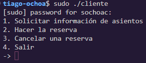
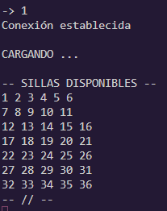
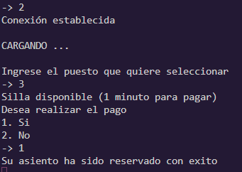
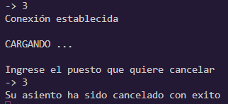

# **Sistema de reservas con semaforos**  

### **Información general**  
> Info de la materia: ST0257 Sistemas Operativos  
> Profesor: Juan Guillermo Lalinde, jlalinde@eafit.edu.co   
> Estudiante(s):   
> - Santiago Ochoa Castaño, sochoac@eafit.edu.co  
> - Simón Correa Henao, scorreah@eafit.edu.co  
> - Miguel Ángel Zapata Jiménez, mazapataj@eafit.edu.co    

## **1. Breve descripción de la actividad**  
En el siguiente proyecto se trató el tema de la concurrencia y la consistencia, enfrentados por medio de sockets tcp locales y semaforos o mutex.

Se realizó la simulación de un sistema de reservas de vuelo para la aerolinea *Apolo Airlines*. Esta simulación se realizó por medio de un modelo cliente-servidor, en el cual el cliente tiene 4 alternativas o funciones para escoger:
1. Consultar los asientos disponibles del vuelo
2. Reservar y pagar un asiento
3. Cancelar una reserva
4. Salir

### **1.1. Que aspectos cumplió o desarrolló de la actividad propuesta por el profesor (requerimientos funcionales y no funcionales)**  
* La interfaz de usuario es basada en texto. 
* El cliente permite que el usuario pueda consultar cuales son los asientos que se encuentran disponibles.  
* El cliente permite que el usuario pueda cancerlar una reserva.  
* La comunicación entre el cliente y el servidor se realiza mediante sockets.  
* El servidor asegura la atomicidad de la escritura, asegurando que todos los clientes deban esperar hasta que el servidor realice una reserva antes de entrar a consultar, o de que se se realice otra reserva simultaneamente
* El servidor utiliza un temporizador de un minuto para confirmar que el cliente realiza el pago de la reserva que esta realizando.  
  
---  
  
## **2. Descripción del ambiente de desarrollo y técnico: lenguaje de programacion, librerias, paquetes, etc.**

### **Detalles técnicos**
* **Lenguaje de programación:** C++
* **g++ version:** 12.2.0
* **Librerías usadas en la aplicación del cliente:** stdio.h, stdlib.h, string.h, socket.h, inet.h, unistd.h, semaphore.h.  
* **Librerias usadas en la aplicación del servidor:** inet.h, pthread.h, semaphore.h, stdio.h, stdlib.h, string.h, string, socket.h, unistd.h, time.h.

### **Detalles del desarrollo**  

* **cliente.cpp**: Se encarga de toda la interfaz del cliente. Permite que el usuario pueda realizar 4 tipos de acciones: Consultar sillas disponibles, Reservar una silla, Cancelar una silla o Salirse de la aplicación. Este programa se encarga de comunicarse con el servidor enviandole el request que el usuario selecciono y posteriormente imprimir la respuesta para que el usuario pueda visualizarla.
* **server.cpp**: Este programa se encarga de recibir las peticiones por parte de la apliación del cliente y realizar el tratamiento adecuado a las peticiones que este le hace. El programa contiene un arreglo el cual representa las sillas del avión. Este arreglo es el que permite toda la gestión de las sillas tanto a la hora de realizar las reservas, como a la hora de cancelarlas.

---

## **3. Descripción del ambiente de EJECUCIÓN:**

**Nota**: Este programa solamente es compatible para Unix/Linux/OSX. 
### **Build**
Unix command:  
Para compilar el cliente:
```bash
    g++ client.cpp -o client -pthread -std=c++11
```
Para compilar el servidor:
```bash
    g++ server.cpp -o server -pthread -std=c++11
```

### **Run**
  
CMD command:  

```bash
sudo ./server
sudo ./client
```
---  

## **4. Manual de usuario:**
1. El cliente tiene las siguientes opciones.  
      
    **Nota**: Para marcar la opción que desea utilizar debe digitar el número respectivo.  

2. Para el caso de solicitar información de asientos.  
      
  
3. Para el caso de realizar una reserva.  
      

4. Para el caso de cancelar reserva.  
    
  
---  

## **5. Referencias**
- [Código base - GeeksForGeeks](https://www.geeksforgeeks.org/handling-multiple-clients-on-server-with-multithreading-using-socket-programming-in-c-cpp/)
- [Guia Sockets - GeeksForGeeks](https://www.geeksforgeeks.org/socket-programming-cc/)
- [Time out - Stackoverflow](https://stackoverflow.com/questions/30395258/setting-timeout-to-recv-function)
